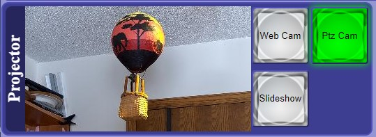
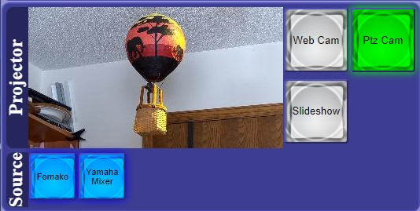
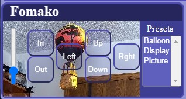
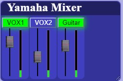
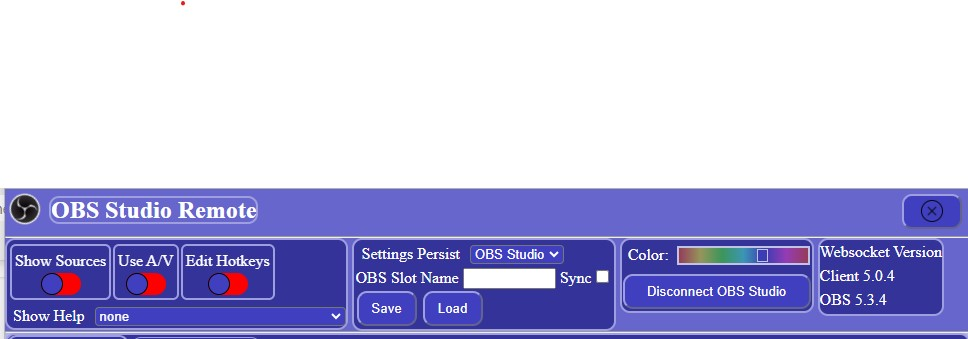
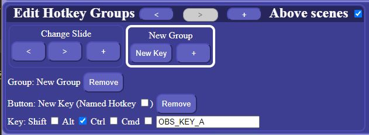

# OBS Studio Remote

OBS Studio remote is a websocket based web application designed to connect with
[OBS Studio](https://obsproject.com/) and 
[AvDeviceControl](https://github.com/jacobvc/AvDeviceControl) 
to provide an integrated control surface for OBS Studio, VISCA 
camera, and MIDI audio device operations.

The primary use case anticipates a need to present a different scene on the
local projector than the one being livecast via the program scene. It 
supports, for example, the ability to change the Program scene without impacting the content of the preview scene.

### Live URL: [http://obs.spiritofpeacecommunity.org/](http://obs.spiritofpeacecommunity.org/)


---


## Features

### General
- Saves connection configuration (IP:Port, password) in browser local data
- Saves settings in browser local data and optionally persists settings in OBS Studio persistent data slot
- Saves OBS Studio persistent data slot name and sync configuration in browser local data
- No installation or extra software is needed, works in any modern browser (desktop or mobile)

### OBS Studio
- Control Preview (Projector) and Program scenes independently
- Change source settings of currently displayed Preview and/or Program views
- Support for Studio Mode (preview and program scenes)
- Live view of preview & program, updating 1 fps
- User defined hotkey configuration (both "named" and "keybord")

### A/V Devices
- Pan, Tilt, and Zoom support for VISCA cameras
- View of 'same name' OBS Studio camera source behind translucent Pan / Tilt / Zoom buttons
- MIDI Audio Mixer Support

---

## OBS Studio Requirements
This project requires OBS websocket v5. This is OBS Studio version dependent, meaning:

- [OBS](https://obsproject.com/) v28 or higher - this includes the latest version of the OBS-websocket plugin
  - OBS v27 is also supported, by manually installing the [OBS-websocket v5](https://github.com/obsproject/obs-websocket/releases/latest) plugin
 - Enabling the OBS-websocket server in OBS under `Tools -> obs-websocket Settings -> Enable WebSocket Server`

---

# Operation

## Connecting
Upon launch, IF there was a previous websocket connection, an automatic connect attempt is performed using the connection configuration (IP:Port, password) stored in browser local data.

If there was not a previous connection, or the connection attempt fails, the manual connect panel will be displayed. Connect by pressing the "Connect" button


The actual operation specifics can be configured as specified in "Configuration and Settings".

## OBS Studio Scene View
Scene View displays the selected scene next to a classic button for each scene that exists in OBS Studio. Pressing the button selects the scene for that view.

When OBS Studio is in studio mode, a Scene View is displayed for each of Preview (labeled Projector) and Program.



When Show Sources is enabled, a button is presented for each source in the scene. Those buttons may be used to enable / disable any of the sources in real time.



## AvDeviceControl VISCA Camera View



## AvDeviceControl MIDI Mixer View



## Configuration and Settings


Expand the settings panel by pressing the hamburger menu button at the right edge of the page heading.



The Settings section of the panel contains:
 
- Show Sources Configuration: Display the OBS Studio source buttons for the 
displayed scene(s) and allow changing which source are active fr each scene.
- Use A/V Configuration: Activate connection to and control of
[AvDeviceControl](https://github.com/jacobvc/AvDeviceControl) application.
- Edit Hotkeys Control: Change hotkeys operation from Operation mode to Edit mode (See Hotkeys section)
- Show Help: Select and display available help topics

The Persist Settings section of the panel controls how and where settings are persisted.


All configuration and settings are stored in the browser local data. The two categories of configuration and setting are:
- Local Data:
  - OBS Studio IP:Port and password
  - AvDeviceControl IP:Port and password
  - Settngs Persist mode
  - OBS Studio slot name 
  - Synchronization enable
- Persisted Data:
  - Show Sources
  - Use A/V
  - Hotkey Configuration (JSON object)

The user interface allows choosing whether to persist settings in OBS Studio or the browser local data. 

When configured to persist settings in OBS Studio, a OBS Studio persisted data slot name must be provided, and synchronization may optionally be enabled.

- Persisted data is saved to OBS Studio, but local data is not.
- Persisted data is retrieved from the slot at OBS Studio connect time
- Persisted data may be saved or loaded manually, but changes are not automatically persisted unless Sync is enabled.


## Hotkeys
Hotkeys are presented as a horizontally aligned set of Hotkey group panels. 

A hotkey panel is a bordered panel containing a group of one or more buttons 
below a label. A button press results in firing the associated hotkey.

The default configuration includes an example "Change Slide" group with a '<'
button connected to the SlideShow.PreviousSlide named hotkey and a '>' button
connected to the SlideSHow.NextSlide named hotkey.


When the Edit Hotkeys switch is turned on, the hotkey display changes to edit
mode. 


Edit mode supports selecting whether the hotkeys appear above or below the
(preview and program) scene displays, adding, removing, and ordering hotkey 
panels, editing button and panel labels, and defining hotkey binding.

In this example, the 'Change Slide' panel and '<' button are in scope. Any of 
the labels may be changed by selecting the test an typing. Either the '<' button
or the entire hotkey panel can be removed by pressing a 'Remove' button, and
the hotkey connection can be configured. In the case of a named hotkey, a
dropdown list of all available named hotkeys is provided. Pressing the '+' 
button will add another button.

Pressing the '+' button in the heading adds a 'New Group' containing one 
'New Key'. 



This example has configured a key sequence (NOT Named Hotkey) as Control-A.
[Look here for available key sequence key values.](https://github.com/obsproject/obs-studio/blob/master/libobs/obs-hotkeys.h)

# Design

### Modules
The modules include:
- App.svelte: THE application
- ObsMain.svelte: OBS Studio support
- PtzCamera.svelte: Camera A/V device support
- AudioMixer.svelte: Audio mixer A/V device support
- Hotkey.svelte: Hotkeys, including editor
- Switch.svelte: Simple Switch
- help.js: Help content
- Preferences.js: Settngs and preferences 

### Help file update
A trivial python script, parse_md.py is provided to parse THIS file and to create a new lib/help.js
```
python parse_md.py
```
It requires the markdown package
```
pip install markdown
```
The script extracts each section starting with a level 2 heading and ignores level 1 headings. It creates a topic using the text of each level 2 heading, and sets the content to the section content markdown-processed-to-html. 

`It also handles image references by assuming the will be in 'public' referenced in README.md as "public/imagename.ext", and stored in the root by build. It replaces '"public/' with '"'.`

A section (like THIS section) may be excluded from the help file by starting with a level 1 heading and NOT CONTAINING any level 2 headings

### Install and build
```
  npm install
or
  npm ci
```
```
  npm run dev
or
  npm run build
```
