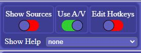
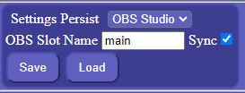
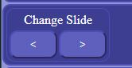
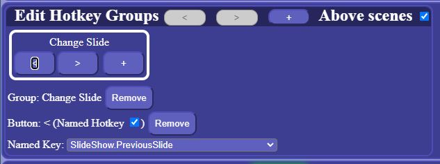

# OBS Studio Remote

#### Control [OBS Studio](https://obsproject.com/), [serial VISCA cameras, and MIDI mixers](https://github.com/jacobvc/AvDeviceControl) remotely

### Live URL: [http://obs.spiritofpeacecommunity.org/](http://obs.spiritofpeacecommunity.org/)


---


## Features

### General
- Saves connection configuration (IP:Port, password) in browser local data
- Saves settings in browser local data and optionally persists settings in OBS Studio persistent data slot
- Saves OBS Studio persistent data slot name and sync configuration in browser local data

### OBS Studio
- No installation or extra software is needed, works in any modern browser (desktop or mobile)
- Control Preview (Projector) and Program scenes independently
- Change source settings for currently displayed Preview and Program views
- Support for Studio Mode (preview and program scenes)

- Live view of preview & output, updating 1 fps

- User defined hotkey configuration (both "named" and "keybord")

### A/V Devices
- Pan, Tilt, and Zoom support for VISCA cameras
- MIDI Audio Mixer Support

---

## OBS Studio Requirements
This project requires OBS websocket v5. This is OBS Studio version dependent, meaning:

- [OBS](https://obsproject.com/) v28 or higher - this includes the latest version of the OBS-websocket plugin
  - OBS v27 is also supported, by manually installing the [OBS-websocket v5](https://github.com/obsproject/obs-websocket/releases/latest) plugin
 - Enabling the OBS-websocket server in OBS under `Tools -> obs-websocket Settings -> Enable WebSocket Server`

---

# Operation
 
## Settings




## Hotkeys




## OBS Studio Operation

## VISCA Camera Operation

## MIDI Mixer Operation

# Design

### Modules
The modules include:
- App.svelte: THE application
- ObsMain.svelte: OBS Studio support
- PtzCamera.svelte: Camera A/V device support
- AudioMixer.svelte: Audio mixer A/V device support
- Hotkey.svelte: Hotkeys, including editor
- Switch.svelte: Simple Switch
- help.js: Help content
- Preferences.js: Settngs and preferences 

### Help file update
A trivial python script, parse_md.py is provided to parse THIS file and to create a new lib/help.js
```
python parse_md.py
```
The script extracts each section starting with a level 2 heading and ignores level 1 headings. It creates a topic using the text of each level 2 heading, and sets the content to the section content markdown-processed-to-html. 

`It also handles image references by assuming the will be in 'public' referenced in README.md as "public/imagename.ext", and stored in the root by build. It replaces '"public/' with '"'.`

A section (like THIS section) may be excluded from the help file by starting with a level 1 heading and NOT CONTAINING any level 2 headings

### Install and build
```
npm install

  npm run dev
or
  npm run build
```
